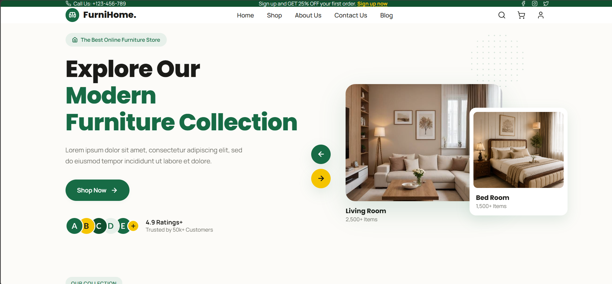
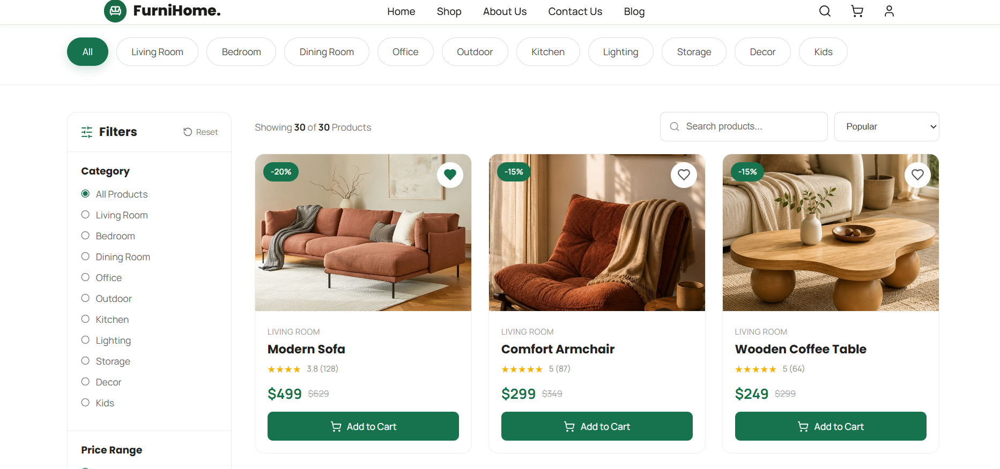
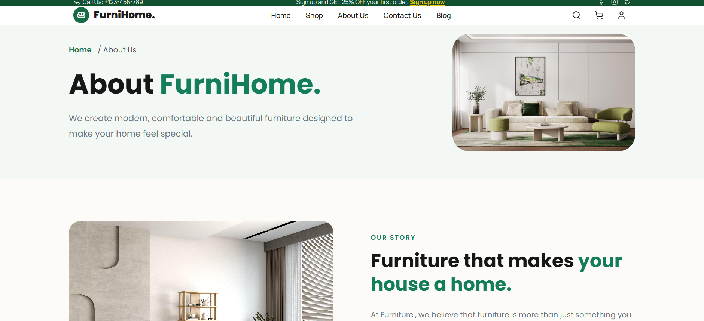
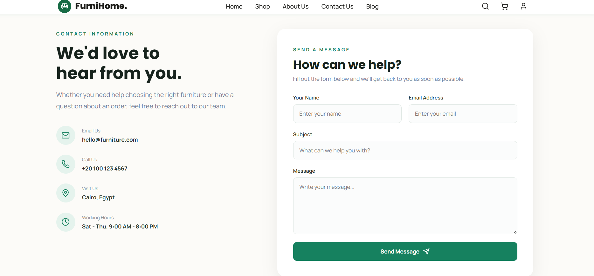
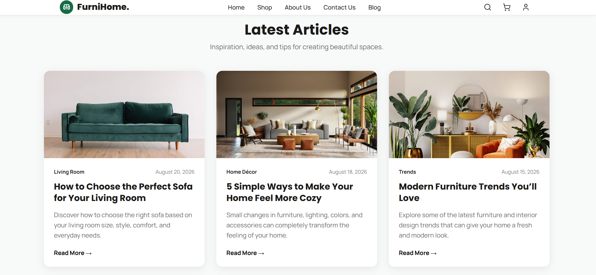

# Furniture Store

<p align="center">
  A modern furniture e-commerce website built with React.js
</p>

<p align="center">
  <strong>Browse. Discover. Furnish.</strong>
</p>

---

## About

Furniture Store is a modern and responsive e-commerce website designed for browsing and exploring furniture products.

The website provides a clean and user-friendly interface with organized product sections, authentication pages, user profile management, wishlist, and shopping cart functionality.

The project was developed using React.js with a focus on reusable components, responsive design, and smooth navigation.

---

## Features

### Home

* Modern landing page
* Featured furniture sections
* Navigation to different areas of the website

### Shop

* Browse furniture products
* Product cards
* Product search and exploration
* Responsive product layout

### Product Details

* Product information
* Product images
* Price and description
* Add products to cart

### User Account

* Login
* Registration
* Profile page
* Edit profile information
* Logout

### Wishlist & Cart

* Add products to wishlist
* Remove products from wishlist
* Add products to cart
* Manage selected products

### Responsive Design

The website is responsive and designed to provide a consistent experience across desktop, tablet, and mobile devices.

---

## Tech Stack

| Technology   | Usage                   |
| ------------ | ----------------------- |
| React.js     | User Interface          |
| JavaScript   | Application Logic       |
| HTML5        | Structure               |
| CSS3         | Styling                 |
| Vite         | Development Environment |
| React Router | Navigation              |
| Lucide React | Icons                   |
| Git          | Version Control         |
| GitHub       | Collaboration           |

---

## Project Structure

```text
src/
│
├── assets/
│
├── components/
│
├── pages/
│
├── App.jsx
└── main.jsx
```

---

## Getting Started

### Prerequisites

Make sure you have the following installed:

* Node.js
* npm
* Git

### Installation

Clone the repository:

```bash
git clone https://github.com/habibalaa21/furniture-project.git
```

Navigate to the project:

```bash
cd furniture-project
```

Install dependencies:

```bash
npm install
```

Start the development server:

```bash
npm run dev
```

Open the local development URL provided by Vite in your browser.

---

## Screenshots

### Home Page



### Shop Page



### About Us



### Contact Us



### Blog


---

## Team

| Name           | Role               |
| -------------- | ------------------ |
| Habiba Alaa    | Frontend Developer |
| Shorouk Azzazy | Frontend Developer |

---

## Future Improvements

* Backend API integration
* Database integration
* Online payment
* Order management
* Admin dashboard
* Product reviews and ratings

---

## Project Purpose

This project was developed as a practical React.js project to apply frontend development concepts including component-based architecture, routing, responsive design, user interfaces, and GitHub collaboration.

---

## License

This project is developed for educational purposes.
